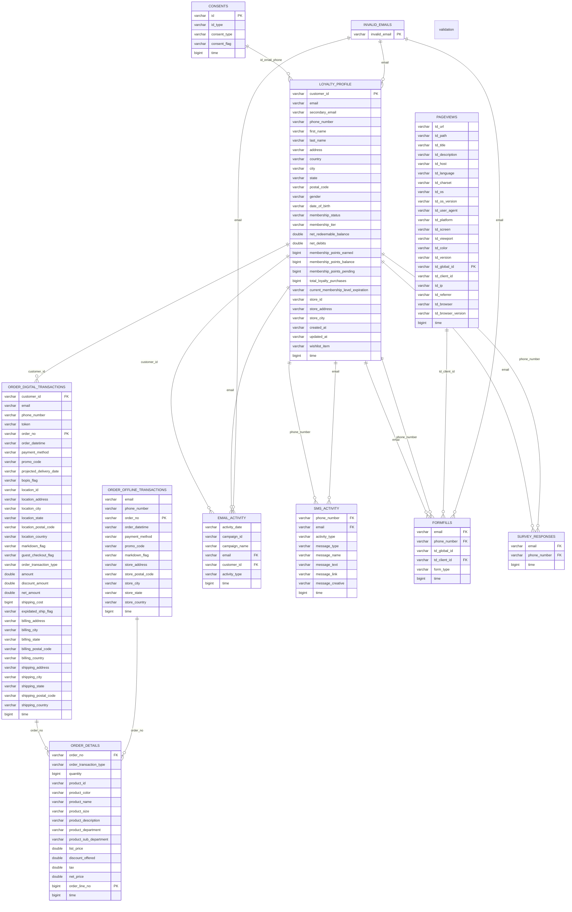

# Treasure Data Value Accelerator - Retail Starter Pack

## Treasure Data Value Accelerator Overview

The CDP collects, cleanses, unifies, segments, and activates data to enhance customer experiences. Treasure Data provides an Out-of-the-Box template to orchestrate all the necessary tasks to make data accessible for segmentation & activation. The data flow through Treasure Data to achieve this is:

There are six main stages to the data flow through the CDP:

### Data Flow Stages

1. **Ingestion** - Batch/Streaming
2. **Data Validation & Transformation** - Data orchestration for Parent Segment Creation
3. **Unification** - Single Customer View [GLD]
4. **Parent Segment Creation**
5. **Segmentation & Activation** - Ad-hoc/Scheduled

## Ingestion

Ingestion is performed using standard Treasure Data connectors or SDKs to land data from source systems into the Treasure Data landing database (SRC database). Data is inserted to the SRC database tables as-is from the source with no transformations. Depending on the source the data may be loaded either via batch on a scheduled basis or streamed in near real-time.

### PRP (Prep) Layer

The retail starter pack includes a PRP layer that sits between raw data ingestion and the source schema. PRP is where data normalization is done:
- Unpacking nested JSON fields
- Concatatenation or separation of fields if necessary
- Early filtering of unnecessary fields
- Record deduplication should happen here as no further deduplication is done downstream

For further details, and specific details on the schema required see Data Ingestion.

### Mapping

The mapping stage transforms data from the PRP layer to conform to the required schema structure for downstream processing.

#### Processing Flow

1. **Schema Configuration**: Column mappings are defined in `schema_map.yml` configuration files
2. **Field Transformation**: PRP columns are mapped to standardized field names and data types
3. **Data Movement**: Mapped data is loaded into the SRC (Source) database
4. **Pipeline Continuation**: Standard validation and staging processes continue with the mapped data

The mapping ensures consistent data structure across all source systems while preserving data lineage and maintaining referential integrity.

## Data Validation & Transformation

Data validation & transformation is the next stage of the data orchestration pipeline. 

In this step the data mapped in the SRC database is validated to ensure schema requirements are met and then loaded by Treasure Data workflows to the staging database (STG database), as a 1:1 copy of data from the source system, with some row-level data cleansing and persistent derivations applied (e.g. flags to indicate the validity of an email address format). (More complex attribute derivations are deferred to the GLD Stage after unificaton is completed – see GLD section.)

## Unification

Unification is the second stage of the scheduled data orchestration that builds the Parent Segment.

Unification is the process of consolidating parties in the source systems to an audience level at which the CDP manages engagement via a Parent Segment. In the Retail Value Accelerator, the source parties are:
- Web visitors identified by cookies
- Customers (former, current & pending) identified by customer ID, email, or phone number
- Transactions from various sources (digital, in-store sales) identified by email, phone number, customer ID or credit card token
- App users identified by analytics IDs and device identifiers
- Survey respondents and SMS recipients

The audience level for the Parent Segment is at an individual person level.

The unification is performed using known relationships held in the source system (such as relationships between emails and customer IDs) and rules for matching using personal data (such as email addresses and phone numbers). Unification assigns a canonical ID as an identifier for the unified individual and creates an identity graph that maps the source identifiers (cookies, customer IDs, emails, phone numbers, device IDs, and credit card tokens) to the canonical ID.

Unification allows the CDP to have a holistic view of an individual, even if that person is identified by different identifiers in the source system.

## Single Customer View [GLD]

Creation of the single customer view is the third stage of the orchestration that builds the Parent Segment.

In this step the data is mapped from the source database operational schema into a schema optimized for the Parent Segment. This involves:
- Mapping source entities into Master, Attribute and Behaviour tables that can be mapped into a Parent Segment
- Performing more complex derivations and data cleansing
- Aggregating source records for an individual and deriving the best values of attributes for that individual as well as aggregate metrics such as Lifetime Value and Average Order Value

## Parent Segment Creation

This is the final stage of the orchestration that builds the Parent Segment, which is the audience within Treasure Data that is made available to users for the creation of segments etc. within the Audience Studio.

In this step the single customer view tables from the GLD database are mapped into the Parent Segment, and the Audience Studio's Parent Segment build is performed. Additionally, certain base segments are created such as High Lifetime Value customers.

## Segmentation & Activation

Segmentation and activation are tasks that can be performed and scheduled by users within a Parent Segment to select a subset of individuals for which data is made available to other systems to deliver Customer Experience Use Cases.

# Data Ingestion

## Required Tables

The following tables and associated columns are required for the value accelerator to run without failure.

### Special Considerations:
- Any of the fields can be empty but the table and column must exist in the database
- Values in each column, except dates which are required to be in ISO8601 format, can be in any format but the preferred format is indicated in the notes sections by Italics
- Additional columns and tables can be included in the source database without issues however additional work is required to make this data available in the Parent Segment for segmentation
- Tables marked with PRP processing will undergo initial transformations before entering the main pipeline

### Loyalty Profile

The Profile Table is the central repository of customer information, aggregated from various interactions and transactions typically originating from a CRM/Loyalty system

| Column | Type | Description |
|--------|------|-------------|
| customer_id | string | Unique Customer ID |
| email | string | Email Address |
| secondary_email | string | Secondary Email Address |
| phone_number | string | Phone Number |
| first_name | string | First Name |
| last_name | string | Last Name |
| address | string | Address |
| city | string | City |
| state | string | State |
| postal_code | string | Postal Code |
| country | string | Country |
| gender | string | Gender |
| date_of_birth | string | ISO8601 Date - Date Of Birth (1990-02-08) |
| favourite_location_names | string | Comma-separated list of location names selected by profile |
| membership_status | string | Current status of Membership Status (Active, Lapsed etc) |
| membership_level | string | Membership tier/level |
| membership_points_balance | double | Current points balance |
| membership_points_earned | double | Total lifetime points earned |
| membership_points_pending | double | Pending points |
| total_loyalty_purchases | int | Number of Purchases made with Loyalty Profile |
| current_membership_level_expiration | string | ISO8601 Date - Date current membership tier/level expires |
| wishlist_items | string | Comma-separated list of wishlist items |
| preferred_store_id | string | Preferred store location ID |
| preferred_store_name | string | Preferred store location name |
| preferred_store_address | string | Preferred store address |
| preferred_store_city | string | Preferred store city |
| preferred_store_state | string | Preferred store state |
| preferred_store_postal_code | string | Preferred store postal code |
| preferred_store_country | string | Preferred store country |
| updated_at | string | ISO8601 Date - Profile Last Updated At Timestamp |
| created_at | string | ISO8601 Date - Profile Create At Timestamp |

### Consents

The Consents Table contains the record of customer permissions regarding customer communication. Consent is managed at the identifier level such as email or phone number.

| Column | Type | Description |
|--------|------|-------------|
| id | string | ID Field can contain mix of emails and phone numbers |
| id_type | string | Type of identifier (email or phone number, etc) |
| consent_type | string | Field indicates if consent is for a specific purpose |
| consent_flag | string | Boolean signaling consent status of a marketable identifier |

### Email Activity

The Email Activity table is the record of all engagement a customer has with email, keeping track of email opens, clicks, etc.

| Column | Type | Description |
|--------|------|-------------|
| activity_date | string | ISO8601 Timestamp of interaction |
| campaign_id | string | Campaign ID associated with Email Activity |
| campaign_name | string | Campaign Name associated with Email Name |
| email | string | Email Address |
| customer_id | string | Customer ID |
| activity_type | string | Activity Type (email_opened, email_sent, email_clicked, email_hardbounced, email_softbounced) |

### SMS Activity

The SMS Activity table records all SMS marketing interactions and engagement.

| Column | Type | Description |
|--------|------|-------------|
| phone_number | string | Phone Number |
| email | string | Email Address |
| activity_type | string | SMS Activity Type |
| message_type | string | Type of message |
| message_name | string | Name of message/campaign |
| message_text | string | Text content of message |
| message_link | string | Link included in message |
| message_creative | string | Creative/template used |
| message_date | string | ISO8601 Date of message |

### Pageviews

The pageviews table is populated by the successful deployment of the Treasure Data JS SDK.

For documentation on deploying the SDK tag please visit: https://docs.treasuredata.com/articles/#!pd/working-with-the-js-sdk

| Column | Type | Description |
|--------|------|-------------|
| td_global_id | string | Treasure Data's 3rd Party Cookie |
| td_version | string | Version of Treasure Data's JS SDK |
| td_client_id | string | Treasure Data's 1st Party Cookie |
| td_charset | string | Browser Charset |
| td_language | string | Browser Language |
| td_color | string | Browser Color |
| td_screen | string | Browser Screensize |
| td_viewport | string | Browser Viewport Size |
| td_title | string | Title of Page |
| td_description | string | Description of Page |
| td_url | string | URL of Page |
| td_user_agent | string | Browser User Agent |
| td_platform | string | Browser Platform |
| td_host | string | Host of Page |
| td_path | string | Path of Page |
| td_referrer | string | Referring source of the page |
| td_ip | string | Browser IP Address |
| td_browser | string | Browser Type |
| td_browser_version | string | Browser Version |
| td_os | string | Browser OS |
| td_os_version | string | Browser OS Version |

### App Analytics

The app analytics table includes analytics data from any mobile App associated with your brand.

| Column | Type | Description |
|--------|------|-------------|
| app_name | string | Name of the mobile app |
| analytics_id | string | ID generated by analytics platform |
| analytics_user_id | string | Analytics platform user ID |
| user_id | string | App user ID |
| customer_id | string | Unique Customer ID |
| email | string | Email Address |
| phone_number | string | Phone Number |
| device_id | string | Device identifier |
| event_type | string | Type of Event Record |
| event_time | string | ISO8601 timestamp of app interaction |
| event_properties | string (JSON) | Customer properties added to event - JSON will be dynamically unpacked |
| user_properties | string (JSON) | User properties - JSON will be dynamically unpacked |
| idfa | string | IDFA ID |
| adid | string | Android ID |
| platform | string | Device platform (iOS, Android) |
| app_version | string | Version of the app |
| device_brand | string | Device manufacturer |
| device_model | string | Device model |
| device_type | string | Type of device |
| os_name | string | Operating system name |
| os_version | string | Operating system version |
| country | string | User country |
| region | string | User region |
| city | string | User city |
| location_lat | double | Location latitude |
| location_lng | double | Location longitude |

### Order Digital Transactions

The digital transactions table should contain all records of purchases made in the App. Line Items for each transaction should appear in the Order Details table.

| Column | Type | Description |
|--------|------|-------------|
| customer_id | string | Unique Customer ID |
| email | string | Email Address |
| phone_number | string | Phone Number |
| token | string | Credit Card Token |
| order_no | string | Order Identifier |
| order_datetime | string | ISO8601 timestamp of transaction |
| payment_method | string | Payment method used for transaction |
| weather | string | Weather when the transaction was made |
| location_id | string | ID of the Location where transaction happened |
| location_address | string | Address of the location where transaction happened |
| location_name | string | Name of the location where transaction happened |
| location_city | string | City of the location where transaction happened |
| location_state | string | State of the location where transaction happened |
| location_postal_code | string | Postal Code of the location where transaction happened |
| location_country | string | Country of the location where transaction happened |
| amount | double | Transaction Amount |
| discount_amount | double | Total discount applied |
| tax_amount | double | Total tax amount |
| tip_amount | double | Tip amount |
| promo_flag | string | Flag indicating any promotion offer/discount was used ('True'/'1', 'False'/'0') |
| markdown_flag | string | Flag indicating there were markdown/sales items included ('True'/'1', 'False'/'0') |
| guest_checkout_flag | string | Flag indicating the transaction happened in guest mode ('True'/'1', 'False'/'0') |
| bopis_flag | string | Buy Online Pick-up In Store flag ('True'/'1', 'False'/'0') |
| delivery_type | string | Type of delivery (Standard, Express, etc) |
| delivery_date | string | ISO8601 Date of delivery |
| billing_address | string | Billing address |
| billing_city | string | Billing city |
| billing_state | string | Billing state |
| billing_postal_code | string | Billing postal code |
| billing_country | string | Billing country |
| shipping_address | string | Shipping address |
| shipping_city | string | Shipping city |
| shipping_state | string | Shipping state |
| shipping_postal_code | string | Shipping postal code |
| shipping_country | string | Shipping country |

### Order Offline Transactions

The offline transactions table should contain all records of in-store purchases.

| Column | Type | Description |
|--------|------|-------------|
| customer_id | string | Unique Customer ID |
| email | string | Email Address |
| phone_number | string | Phone Number |
| token | string | Credit Card Token |
| order_no | string | Order Identifier |
| order_datetime | string | ISO8601 timestamp of transaction |
| payment_method | string | Payment method used for transaction |
| weather | string | Weather when the transaction was made |
| location_id | string | ID of the Location where transaction happened |
| location_address | string | Address of the location where transaction happened |
| location_name | string | Name of the location where transaction happened |
| location_city | string | City of the location where transaction happened |
| location_state | string | State of the location where transaction happened |
| location_postal_code | string | Postal Code of the location where transaction happened |
| location_country | string | Country of the location where transaction happened |
| amount | double | Transaction Amount |
| promo_flag | string | Flag indicating any promotion offer/discount was used ('True'/'1', 'False'/'0') |
| markdown_flag | string | Flag indicating there were markdown/sales items included ('True'/'1', 'False'/'0') |

### Order Details

This table details each line item of each transaction describing each product that was purchased, its price, quantity etc.

| Column | Type | Description |
|--------|------|-------------|
| order_no | string | Order Identifier |
| order_line_no | string | Line Item # |
| order_transaction_type | string | Type of transaction line item is associated with (Digital, Offline, etc) |
| quantity | double | Number of Products Purchase for Line Item |
| list_price | double | Total List/Retail Price of Line Item |
| discount_offered | double | Total Discount Amount of Line Item |
| tax | double | Total Tax Amount of Line Item |
| net_price | double | Total Net Price of Line Item |
| product_id | string | Product ID of Product Purchased |
| product_size | string | Product Size of Product Purchased |
| product_color | string | Product Color of Product Purchased |
| product_name | string | Product Name of Product Purchased |
| product_description | string | Product Description of Product Purchased |
| product_department | string | Product Department/Category of Product Purchased |
| product_sub_department | string | Product Sub Department/Sub Category of Product Purchased |

### Formfills

The form fills table will also be populated by Treasure Data's SDK. When customers log in or provide PII, the SDK will be configured to send over identifiable information like email or phone number to create a mapping between the 1st party cookie and PII to turn anonymous browsers into known profiles.

| Column | Type | Description |
|--------|------|-------------|
| email | string | Email Address |
| phone_number | string | Phone Number |
| td_global_id | string | Treasure Data's 3rd Party Cookie |
| td_client_id | string | Treasure Data's 1st Party Cookie |
| form_type | string | Type of Form Completed (Account Signup, Newsletter etc) |

### Survey Responses

The survey responses table captures customer feedback and survey data.

| Column | Type | Description |
|--------|------|-------------|
| survey_id | string | Unique survey identifier |
| respondent_id | string | Unique respondent identifier |
| question_id | string | Question identifier |
| question_text | string | Text of the question |
| answer | string | Text answer provided |
| answer_numeric | double | Numeric answer (for rating questions) |
| customer_id | string | Customer ID if known |
| email | string | Email address |
| phone_number | string | Phone number |
| submission_date | string | ISO8601 Date of submission |

## ERD

The Entity Relationship Diagram shows how all tables connect through various identifiers to create a unified customer view:



### Key Relationships

- **Customer Identity Hub**: `customer_id`, `email`, `phone_number` serve as primary linking fields
- **Transaction Linking**: Orders connect through `order_no` to order details
- **Web/App Tracking**: Cookies (`td_client_id`, `td_global_id`) link anonymous behavior to known profiles via formfills
- **Session Continuity**: Pageviews connect to formfills via `td_client_id` to track customer journey
- **Consent Management**: Linked via `id` field (email/phone) to ensure proper communication preferences
- **Data Quality**: Invalid emails are filtered across all email-related tables

## Data Validation & Transformation

The retail starter pack includes comprehensive validation queries that:
1. Check for required columns in each table
2. Validate data types match expectations
3. Report missing critical fields
4. Generate warnings for data quality issues
5. Apply PRP transformations where configured

Validation results are logged and can trigger email notifications for critical issues.

# PRP (Prep) Layer Customization

The PRP layer provides a flexible preprocessing step that allows custom data transformations before the standard schema mapping occurs. This is essential when your raw data doesn't directly match the expected table structure.

## Why PRP is Required

Many source systems provide data that needs transformation before it can be mapped to the standard Value Accelerator schema:

- **Nested JSON**: Event properties stored as JSON objects need to be unpacked into separate columns
- **Concatenated Fields**: Single fields containing multiple values (e.g., "John Doe" → first_name, last_name)
- **Field Separation**: Combined addresses that need splitting into components
- **Data Type Conversion**: String dates that need parsing or numeric fields stored as text

## Common Use Cases

### 1. JSON Unpacking
```sql
-- Raw data has: event_properties = '{"product_id": "123", "category": "electronics"}'
-- PRP query unpacks to separate columns:
SELECT 
  *,
  JSON_EXTRACT_SCALAR(event_properties, '$.product_id') as product_id,
  JSON_EXTRACT_SCALAR(event_properties, '$.category') as category
FROM raw_app_analytics
```

### 2. Field Concatenation/Separation
```sql
-- Combine separate name fields
SELECT 
  *,
  CONCAT(first_name, ' ', last_name) as full_name
FROM raw_loyalty_profile

-- Or separate combined fields
SELECT 
  *,
  SPLIT_PART(full_address, ',', 1) as street_address,
  SPLIT_PART(full_address, ',', 2) as city,
  SPLIT_PART(full_address, ',', 3) as state
FROM raw_customer_data
```

## How to Implement Custom PRP Queries

### Step 1: Check Configuration
In `config/schema_map.yml`, find your table configuration:
```yaml
- columns: [...]
  prp_table_name: loyalty_profile  # If this exists, PRP processing will run
  src_table_name: loyalty_profile 
```

If `prp_table_name` is set to `"not exists"`, no PRP processing occurs and data passes directly to mapping.

### Step 2: Create Custom PRP Query
Create or modify the file: `prep/queries/{table_name}.sql`

**Example**: `prep/queries/loyalty_profile.sql`
```sql
-- Custom transformation for loyalty profile data
SELECT 
  customer_id,
  email,
  -- Unpack JSON preferences
  JSON_EXTRACT_SCALAR(preferences, '$.communication_email') as email_opt_in,
  JSON_EXTRACT_SCALAR(preferences, '$.communication_sms') as sms_opt_in,
  -- Separate full name
  SPLIT_PART(full_name, ' ', 1) as first_name,
  SPLIT_PART(full_name, ' ', -1) as last_name,
  -- Calculate age from birthdate string
  DATE_DIFF('year', DATE_PARSE(birth_date, '%m/%d/%Y'), CURRENT_DATE) as age,
  -- Pass through other fields
  phone_number,
  address,
  time
FROM ${raw}_${sub}.loyalty_profile
WHERE time > ${last_load_time}
```

### Step 3: Update Schema Mapping
Ensure your `schema_map.yml` references any prp tables under `prp_table_name` that are in scope for processing. 

> [!IMPORTANT]
> If prp_table_name = 'not exsits' no processing will occur for that table. 
>
> If prp_table_name does not match sql file name in `prep/queries/{table_name}.sql` the workflow will error out. 

```yaml
  prp_table_name: loyalty_profile  # Enables PRP processing, workflow will look for prep/queries/loyalty_profile.sql to apply any prep logic. 
  src_table_name: loyalty_profile
```

## File Locations

- **PRP Queries**: `prep/queries/{table_name}.sql`
- **Configuration**: `config/schema_map.yml`
- **Workflow**: `wf02_mapping.dig` (handles PRP execution)

## When No PRP is Needed

If your raw data already matches the expected structure, no action is needed, the data will just pass through to the `${prp}_${sub}` database

# Schema Mapping Configuration

The mapping stage transforms data from the PRP layer (or raw data if no PRP) into the standardized Source (SRC) schema required by the Value Accelerator. This stage handles field renaming, data type casting, and ensures all tables conform to the expected structure.

## Why Mapping is Required

Different source systems use varying field names, data types, and structures. The mapping layer standardizes this data into a consistent schema that the downstream unification and analytics processes expect:

- **Field Name Standardization**: Maps source field names to standard Value Accelerator field names
- **Data Type Casting**: Ensures fields have the correct data types (varchar, bigint, double, etc.)
- **Schema Consistency**: Guarantees all tables conform to the expected structure
- **Incremental Processing**: Handles delta loads efficiently using time-based filtering
- **Null Handling**: Manages missing or null values appropriately

## Configuration Structure

The mapping is entirely configured in `config/schema_map.yml`. Each table has a configuration block that defines:

```yaml
- columns:
  - prp: source_field_name    # Field name in PRP table (or "null" if creating empty field)
    src: target_field_name    # Field name in SRC table that should match required fields
    type: varchar            # Target data type (varchar, bigint, double)
  prp_table_name: table_name  # PRP table name (or "not exists" to skip PRP and generate empty table)
  src_table_name: table_name  # Target table name in SRC database
```

## Common Mapping Patterns

### 1. Direct Field Mapping
```yaml
- prp: customer_id
  src: customer_id
  type: varchar
```

### 2. Field Renaming
```yaml
- prp: external_id      # Source system uses "external_id"
  src: customer_id      # Value Accelerator expects "customer_id"
  type: varchar
```

### 3. Creating Null Fields
```yaml
- prp: null            # No source field available
  src: secondary_email  # Create empty secondary_email field
  type: varchar
```

### 4. Data Type Conversion
```yaml
- prp: order_total     # Source has as string
  src: amount          # Convert to numeric
  type: double
```

## Example Configuration

Here's a complete mapping configuration for loyalty profiles:

```yaml
- columns:
  # Customer identifiers
  - prp: external_id
    src: customer_id
    type: varchar
  - prp: email
    src: email
    type: varchar
  - prp: phone_number
    src: phone_number
    type: varchar
    
  # Personal information
  - prp: first_name
    src: first_name
    type: varchar
  - prp: last_name
    src: last_name
    type: varchar
  - prp: address1
    src: address
    type: varchar
    
  # Location data
  - prp: city
    src: city
    type: varchar
  - prp: state
    src: state
    type: varchar
  - prp: zip
    src: postal_code
    type: varchar
    
  # Fields not available in source system
  - prp: null
    src: secondary_email
    type: varchar
  - prp: null
    src: gender
    type: varchar
    
  # Required system fields
  - prp: time
    src: time
    type: bigint
    
  prp_table_name: loyalty_profile
  src_table_name: loyalty_profile
```

## How Mapping Works

The mapping process is handled by `mapping/queries/map.sql` which:

1. **Reads Configuration**: Parses the column mappings from `schema_map.yml`
2. **Generates Dynamic SQL**: Creates transformation queries based on the mappings
3. **Applies Type Casting**: Uses `TRY_CAST()` to safely convert data types
4. **Handles Incremental Loads**: Filters new records based on the `time` field
5. **Creates SRC Tables**: Outputs standardized data to the SRC database

## File Locations

- **Configuration**: `config/schema_map.yml`
- **Mapping Logic**: `mapping/queries/map.sql`
- **Workflow**: `wf02_mapping.dig`

## Troubleshooting

### Common Issues

1. **Missing Fields**: If a `prp` field doesn't exist in the source table, the mapping will fail
2. **Type Mismatches**: Ensure the `type` specified can accommodate the source data
3. **Table Name Mismatches**: Verify `prp_table_name` matches actual table names

> [!IMPORTANT]
> Always test mapping changes in a development environment before applying to production. The validation workflow will catch most issues, but data type casting failures can cause workflow errors.

# Data Validation System

The validation system automatically verifies that your data structure and content meet the requirements for successful Value Accelerator processing. This system runs after the mapping stage and requires no user configuration - it's designed to catch issues early and provide clear guidance for resolution.

## Why Validation is Required

Data validation ensures the integrity and completeness of your data pipeline before expensive downstream processing begins:

- **Schema Compliance**: Verifies all required tables and columns exist with correct data types
- **Early Error Detection**: Catches structural issues before they cause workflow failures
- **Data Quality Assessment**: Identifies potential data quality issues that may impact results
- **Automated Reporting**: Provides detailed reports of any issues found
- **Workflow Protection**: Prevents bad data from flowing into unification and segmentation

## What Gets Validated

### 1. Table Existence
The system checks that all required tables are present in your SRC database:
- `loyalty_profile`
- `email_activity` 
- `pageviews`
- `formfills`
- `order_details`
- `order_digital_transactions`
- `order_offline_transactions`
- `consents`
- `sms_activity`
- `survey_responses`

### 2. Column Presence
For each table, validates that all required columns exist:
- **Customer identifiers**: `customer_id`, `email`, `phone_number`
- **System fields**: `time` (required for all tables)
- **Table-specific fields**: Each table has its own required column set

### 3. Data Type Compliance
Ensures columns have the expected data types:
- `varchar` fields can store text data
- `bigint` fields contain integer values
- `double` fields contain numeric values
- `time` fields are proper Unix timestamps

### 4. Data Quality Checks
Identifies potential data quality issues:
- Missing critical identifiers
- Invalid email formats
- Null values in required fields
- Unusual data patterns

## How Validation Works

The validation process follows these steps:

### Step 1: Reference Schema Creation
**Location**: `validation/queries/schema/*.sql`

The system creates reference tables that define the expected structure for each table. These serve as the "gold standard" for comparison.

### Step 2: Schema Comparison
**Location**: `validation/queries/check_src_vs_ref.sql`

Compares your actual SRC tables against the reference schema to identify:
- Missing tables
- Missing columns
- Data type mismatches
- Extra tables/columns (informational only)

### Step 3: Issue Classification
**Location**: `validation/queries/report_deviations.sql`

Categorizes findings into:
- **Errors**: Critical issues that will halt processing
- **Warnings**: Data quality concerns that allow processing to continue

### Step 4: Report Generation
**Location**: `validation/python/gen_html.py`

Creates detailed HTML reports showing:
- Summary of all issues found
- Table-by-table breakdown
- Specific missing columns or type mismatches
- Recommended actions

### Step 5: Notification and Decision
**Workflow**: `wf03_validate.dig`

- Sends email reports to configured stakeholders
- Halts workflow execution if critical errors are found
- Allows processing to continue if only warnings are present

## Understanding Validation Reports

### Error Types

#### Missing Tables
```
Error: Missing tables from source database src_retail.
Check va_config_retail.report_missing_tables_in_src for missing tables.
```
**Resolution**: Ensure all required tables exist in your SRC database

#### Missing Columns
```
Error: Missing columns from source database src_retail.
Check va_config_retail.report_missing_src_columns for missing columns.
```
**Resolution**: Update your schema mapping to include all required columns

#### Data Type Mismatches
```
Error: Mismatched column types from source database src_retail.
Check va_config_retail.report_column_type_mismatches for column type mismatches.
```
**Resolution**: Verify data type specifications in your schema mapping configuration

### Warning Types
- Unusual data distributions
- High null percentages in identifier fields
- Data quality concerns that don't prevent processing

## Validation Tables

The validation process creates several reporting tables in the `va_config_${sub}` database:

| Table | Purpose |
|-------|---------|
| `report_missing_tables_in_src` | Lists tables missing from SRC database |
| `report_missing_src_columns` | Details missing columns by table |
| `report_column_type_mismatches` | Shows data type conflicts |
| `report_deviation` | Summary of all issues by type and severity |

## Automatic Email Notifications

**Configuration**: `config/email_ids.yml`

The system automatically sends HTML email reports to configured recipients when issues are detected. These emails include:

- Executive summary of validation results
- Detailed breakdown of specific issues
- Links to validation tables for investigation
- Recommended next steps

## File Locations

- **Schema Definitions**: `validation/queries/schema/*.sql`
- **Validation Logic**: `validation/queries/check_src_vs_ref.sql`
- **Report Generation**: `validation/queries/report_deviations.sql`
- **HTML Formatting**: `validation/python/gen_html.py`
- **Workflow**: `wf03_validate.dig`
- **Email Configuration**: `config/email_ids.yml`

## What Happens After Validation

### If No Issues Found
- Workflow continues to staging and unification
- Processing proceeds normally

### If Warnings Only
- Email notifications sent to stakeholders
- Workflow continues with data quality notes
- Issues logged for monitoring

### If Errors Found
- **Workflow halts immediately**
- Detailed error reports generated
- Email alerts sent to technical team
- Manual intervention required before proceeding

## Best Practices

1. **Monitor Email Reports**: Set up proper email distribution lists in `config/email_ids.yml`
2. **Regular Review**: Check validation reports even when workflows succeed
3. **Trend Analysis**: Monitor data quality trends over time
4. **Proactive Testing**: Run validation in development before production deployments

> [!NOTE]
> The validation system is fully automated and requires no user configuration. It's designed to be comprehensive and catch issues early in the pipeline to prevent downstream failures.

# Staging Data Transformation

The staging layer automatically applies sophisticated data cleansing, standardization, and enrichment transformations to prepare your data for unification. This process runs automatically after validation and requires no user configuration - it's designed to handle common data quality issues and standardize formats across all source systems.

## Why Staging Transformation is Required

Raw data from different systems often contains inconsistencies that would impact unification quality and analytics accuracy:

- **Format Standardization**: Ensures consistent data formats across all sources
- **Data Cleansing**: Removes invalid characters and standardizes representations
- **Enrichment**: Adds derived fields and calculations for better analytics
- **Null Handling**: Standardizes how null and empty values are represented
- **Validation Flags**: Creates indicators for data quality assessment
- **Type Conversion**: Ensures proper data types for downstream processing

## Automatic Transformations Applied

### 1. Email Processing
**Applied to**: All tables with email fields

```sql
-- Email format validation
cast(COALESCE(regexp_like("email", 
  '^(?=.{1,256})(?=.{1,64}@.{1,255}$)[A-Za-z0-9._%-]+@[A-Za-z0-9.-]+\.[A-Za-z]{2,4}$'), 
  false) as varchar) AS "valid_email_flag"

-- Email standardization
case
  when nullif(lower(ltrim(rtrim("email"))), 'null') is null then null
  when nullif(lower(ltrim(rtrim("email"))), '') is null then null
  when nullif(lower(trim("email")), '') in (select lower(trim(invalid_email)) from invalid_emails) then null
  else lower(ltrim(rtrim(regexp_replace("email", '[^a-zA-Z0-9.@_+-]', ''))))
end AS "trfmd_email"
```

**What this does**:
- Creates `valid_email_flag` to identify properly formatted emails
- Standardizes emails to lowercase
- Removes invalid characters
- Filters out known invalid email addresses
- Handles null representations consistently

### 2. Phone Number Standardization
**Applied to**: All tables with phone number fields

```sql
case
  when nullif(lower(ltrim(rtrim("phone_number"))), 'null') is null then null
  when nullif(lower(ltrim(rtrim("phone_number"))), '') is null then null
  else ARRAY_JOIN(REGEXP_EXTRACT_ALL(replace(lower(ltrim(rtrim("phone_number"))), ' ', ''), '([0-9]+)?'), '')
end AS "trfmd_phone_number"
```

**What this does**:
- Extracts only numeric digits from phone numbers
- Removes spaces, dashes, parentheses, and other formatting
- Standardizes to digits-only format
- Handles various null representations

### 3. Name and Text Field Processing
**Applied to**: Names, addresses, and other text fields

```sql
-- Proper case conversion
array_join((transform((split(lower(trim("first_name")),' ')), x -> concat(upper(substr(x,1,1)),substr(x,2,length(x))))),' ','') AS "trfmd_first_name"

-- Full name generation
array_join((transform((split(lower(trim(concat(first_name,' ',last_name))),' ')), x -> concat(upper(substr(x,1,1)),substr(x,2,length(x))))),' ','') AS "trfmd_full_name"
```

**What this does**:
- Converts text to proper title case
- Trims whitespace consistently
- Generates full names from component parts
- Handles multi-word names properly

### 4. Date and Time Processing
**Applied to**: All date/time fields

```sql
-- Unix timestamp conversion
TD_TIME_PARSE(order_datetime) as trfmd_order_datetime_unix

-- Age calculation
date_diff('year',
  coalesce(
    try(date_parse(date_of_birth, '%Y-%m-%d %H:%i:%s.%f')),
    try(date_parse(date_of_birth, '%Y-%m-%d %H:%i:%s')),
    try(date_parse(date_of_birth, '%Y-%m-%d')),
    try(date_parse(date_of_birth, '%m/%d/%Y %H:%i:%s.%f')),
    try(date_parse(date_of_birth, '%m/%d/%Y %H:%i:%s')),
    try(date_parse(date_of_birth, '%m/%d/%Y'))
  ), current_date
) AS "trfmd_age"

-- Season derivation
case
  when month(from_unixtime(TD_TIME_PARSE(order_datetime))) in (12, 1, 2) then 'Winter'
  when month(from_unixtime(TD_TIME_PARSE(order_datetime))) in (3, 4, 5) then 'Spring'
  when month(from_unixtime(TD_TIME_PARSE(order_datetime))) in (6, 7, 8) then 'Summer'
  when month(from_unixtime(TD_TIME_PARSE(order_datetime))) in (9, 10, 11) then 'Fall'
  else null
end AS "trfmd_season"
```

**What this does**:
- Converts various date formats to standardized Unix timestamps
- Calculates age from birth dates using multiple format attempts
- Derives seasonal information from transaction dates
- Handles multiple date format variations automatically

### 5. Boolean Flag Standardization
**Applied to**: All flag fields (bopis_flag, guest_checkout_flag, etc.)

```sql
case
  when nullif(lower(ltrim(rtrim("bopis_flag"))), 'null') is null then null
  when nullif(lower(ltrim(rtrim("bopis_flag"))), '') is null then null
  when nullif(lower(ltrim(rtrim("bopis_flag"))), '') in ('0', 'false') then 'False'
  when nullif(lower(ltrim(rtrim("bopis_flag"))), '') in ('1', 'true') then 'True'
end AS "trfmd_bopis_flag"
```

**What this does**:
- Standardizes boolean representations to 'True'/'False'
- Handles various input formats (0/1, true/false, etc.)
- Manages null and empty values consistently

### 6. Geographic Data Standardization
**Applied to**: Address, city, state, country fields

```sql
case
  when nullif(lower(ltrim(rtrim("country"))), 'null') is null then null
  when nullif(lower(ltrim(rtrim("country"))), '') is null then null
  else array_join((transform((split(lower(trim("country")),' ')), x -> concat(upper(substr(x,1,1)),substr(x,2,length(x))))),' ','')
end AS "trfmd_country"
```

**What this does**:
- Standardizes geographic names to proper title case
- Removes extra whitespace and formatting
- Handles abbreviated and full state names
- Normalizes international address formats

## Table-Specific Transformations

### Loyalty Profile
- **Age Calculation**: Dynamic age from birth date with multiple format support
- **Full Name Generation**: Combines first and last names properly
- **Membership Data**: Standardizes tier and status values
- **Geographic Normalization**: Standardizes all address components

### Transaction Tables (Digital/Offline)
- **Season Derivation**: Automatically categorizes transactions by season
- **Payment Method Standardization**: Normalizes payment type representations
- **Location Data**: Standardizes store and shipping address formats
- **Flag Processing**: Ensures consistent boolean representations

### Email Activity
- **Campaign Name Processing**: Standardizes campaign naming conventions
- **Activity Type Normalization**: Ensures consistent activity categorization
- **Date Processing**: Converts activity dates to standardized timestamps

### SMS Activity
- **Message Content Processing**: Standardizes message text and metadata
- **Activity Type Classification**: Normalizes SMS interaction types
- **Contact Information**: Applies standard phone/email processing

### Pageviews
- **URL Processing**: Standardizes web tracking data
- **Browser Information**: Normalizes user agent and platform data
- **Technical Metadata**: Standardizes web technical attributes

## Data Quality Indicators

The staging process creates several quality indicator fields:

| Field | Purpose |
|-------|---------|
| `valid_email_flag` | Indicates properly formatted email addresses |
| `trfmd_age` | Calculated age with validation |
| `trfmd_season` | Seasonal transaction categorization |
| `trfmd_full_name` | Properly formatted complete names |

## Invalid Data Handling

### Email Filtering
The system automatically filters out invalid emails using the `invalid_emails` table:
- Known test/dummy email addresses
- Malformed email patterns
- System-generated placeholder emails

### Null Value Processing
Standardizes various null representations:
- Empty strings (`''`)
- String literals (`'null'`, `'NULL'`)
- Actual null values
- Whitespace-only values

## File Locations

- **Staging Queries**: `staging/queries/*.sql`
- **Invalid Email List**: `staging/queries/invalid_emails.sql`
- **Workflow**: `wf04_stage.dig`

## Transformation Results

After staging transformation, your data will have:

1. **Consistent Formatting**: All similar fields follow the same format standards
2. **Quality Indicators**: Flags to identify data quality issues
3. **Enriched Fields**: Additional calculated and derived fields
4. **Standardized Types**: Proper data types for all fields
5. **Clean Values**: Removed invalid characters and standardized representations

## What Happens Next

After staging transformation:
- Data moves to the unification process
- All transformations are preserved with `trfmd_` prefixes
- Original values remain available for audit purposes
- Quality indicators are available for analytics and segmentation

> [!NOTE]
> All staging transformations are automatic and require no configuration. The system applies industry-standard data cleansing and normalization practices to ensure high-quality data for downstream processing.

# Customer Unification

The Value Accelerator uses Treasure Data's built-in customer ID unification to automatically create unified customer profiles by linking records across all data sources. This process runs automatically after staging and requires no user configuration.

For detailed information about how customer ID unification works, see the [Treasure Data Customer ID Unification documentation](https://docs.treasuredata.com/articles/#!pd/customer-id-unification).

## Unification Configuration in Value Accelerator

**Location**: `unification/unify.yml`

The Value Accelerator comes pre-configured with unification rules that define how customer identities are linked across tables (see ERD above for reference):

## How Unification Works in the Value Accelerator

### Identity Linking Strategy
The system connects customer records using these identifier relationships:

1. **Customer ID Linking**: Direct customer identifiers from loyalty systems
2. **Email-Based Linking**: Email addresses across all touchpoints (loyalty, transactions, email activity, form fills)
3. **Phone Number Linking**: Phone numbers from profiles, transactions, and form fills
4. **Device Linking**: Web cookies (`td_client_id`, `td_global_id`) from pageviews and form fills
5. **Cross-Channel Connection**: Form fills bridge anonymous web behavior to known customer identities

### Key Identity Bridges

#### Anonymous to Known Customer Journey
```
Pageview (td_client_id) → Form Fill (td_client_id + email) → Customer Profile (email)
```

#### Multi-Channel Customer View
```
Loyalty Profile (customer_id + email) → Email Activity (email) → Transactions (email/phone)
```

#### Device-to-Customer Mapping
```
Multiple pageviews (td_client_id) → Form fill (td_client_id + email) → All customer activities (email)
```

## Pre-Configured Tables and Identifiers

The Value Accelerator automatically unifies these tables using the specified identifiers:

| Table | Identifiers Used for Unification |
|-------|----------------------------------|
| `loyalty_profile` | `customer_id`, `email`, `phone_number` |
| `email_activity` | `customer_id`, `email` |
| `sms_activity` | `phone_number`, `email` |
| `pageviews` | `td_client_id`, `td_global_id` |
| `formfills` | `td_client_id`, `email`, `phone_number`, `td_global_id` |
| `order_digital_transactions` | `customer_id`, `email`, `phone_number`, `token` |
| `order_offline_transactions` | `customer_id`, `email`, `phone_number` |
| `order_details` | `order_no` (linked via order tables) |
| `survey_responses` | `customer_id`, `email`, `phone_number` |
| `consents` | `id` (email or phone number) |


## File Locations

- **Configuration**: `unification/unify.yml`
- **Workflow**: `wf05_unify.dig`
- **Output**: Unified tables in GLD (Golden) database

## Unification Results

After unification processing:

1. **Unified Customer Profiles**: Each unique customer has one canonical ID
2. **Cross-Channel Identity Mapping**: All customer identifiers linked together
3. **Anonymous-to-Known Journey**: Web visitors connected to customer profiles via form fills
4. **Complete Customer Context**: All interactions unified under single customer view

## What Happens Next

After unification:
- Unified customer data moves to the Golden (GLD) database
- Single customer view enables accurate customer journey analysis
- Segmentation and analytics operate on complete customer profiles
- Personalization systems access comprehensive customer context

> [!NOTE]
> Customer unification uses Treasure Data's built-in unification engine and requires no manual configuration. The Value Accelerator comes pre-configured with appropriate identity keys and linking rules for retail customer data.

# Golden Layer (Single Customer View)

The Golden layer automatically creates the single customer view by transforming unified data into optimized Master, Attribute, and Behavior tables. This process runs automatically after unification and requires no user configuration - it aggregates customer data, derives best attribute values, and calculates key metrics for segmentation and analytics.

## Why the Golden Layer is Required

The unified data from the previous stage contains all customer touchpoints but needs to be restructured for optimal analytics and segmentation:

- **Single Customer Records**: Consolidates multiple records per customer into single profiles
- **Best Value Selection**: Chooses the most reliable values when customers have conflicting data
- **Metric Calculation**: Computes key business metrics like Lifetime Value and Average Order Value
- **Attribute Derivation**: Creates enriched customer attributes from behavioral data
- **Analytics Optimization**: Structures data for efficient segmentation and reporting
- **Master Data Creation**: Establishes authoritative customer records for downstream systems

## Golden Layer Structure

The Golden layer creates three types of optimized tables:

### Master Tables
**Purpose**: Single authoritative record per customer
- **Customer Master**: One record per unified customer with best demographic data

### Attribute Tables  
**Purpose**: Enriched customer characteristics and preferences
- **Customer Attributes**: Derived preferences, segments, and calculated fields
- **Behavioral Attributes**: Purchase patterns, engagement preferences
- **Demographic Attributes**: Age groups, geographic clusters, household characteristics

### Behavior Tables
**Purpose**: Individual interaction and transaction records
- **Purchase Behavior**: Transactions, Line Item Transaction Details
- **Engagement Behavior**: Email, SMS, and web interaction records

## Automatic Data Processing

### 1. Customer Profile Consolidation
**Source**: Unified staging tables
**Process**: `golden/queries/all_profile_identifiers.sql`

The query creates a table of all customer identifiers which can be useful for activation

### 2. Attribute Derivation
**Location**: `golden/queries/attributes/*.sql`

#### Email Activity Attributes
**Source**: `golden/queries/attributes/email_activity.sql`
```sql
-- Example derived email engagement metrics
email_sends_30d,
email_opens_30d, 
email_clicks_30d,
email_engagement_rate,
preferred_send_time,
most_engaged_campaign_type
```

#### Transaction Attributes  
**Source**: `golden/queries/attributes/transactions.sql`
```sql
-- Example derived transaction metrics
total_purchases,
total_spend,
average_order_value,
lifetime_value,
days_since_last_purchase,
preferred_payment_method,
seasonal_purchase_pattern
```

#### Pageview Attributes
**Source**: `golden/queries/attributes/pageviews.sql`
```sql
-- Example derived web behavior metrics  
total_sessions_30d,
pages_per_session_avg,
preferred_device_type,
top_product_categories_viewed,
conversion_likelihood_score
```

#### Survey Response Attributes
**Source**: `golden/queries/attributes/survey_responses.sql`
```sql
-- Example derived survey insights
satisfaction_score_avg,
nps_score,
feedback_sentiment,
preferred_contact_method,
product_satisfaction_ratings
```

### 3. Calculated Metrics

#### Customer Lifetime Value (CLV)
```sql
-- Calculates total customer value and projected future value
SUM(transaction_amount) as historical_clv,
(AVG(transaction_amount) * purchase_frequency * predicted_lifespan) as predicted_clv
```

## File Locations

- **Profile Queries**: `golden/queries/all_profile_identifiers.sql`
- **Attribute Derivation**: `golden/queries/attributes/*.sql` 
- **Copy Utilities**: `golden/queries/copy_*.sql`
- **Workflow**: `wf06_golden.dig`
- **Output**: Optimized tables in GLD database

## What Happens Next

After Golden layer creation:
- Analytics tables are generated for dashboards 
- Parent segments are created from enriched customer data

> [!NOTE]
> The Golden layer processing is fully automated and requires no configuration. The system applies retail industry best practices to create comprehensive single customer views optimized for segmentation and analytics.

# Parent Segment

The Parent Segment automatically creates a comprehensive customer view within Treasure Data's Audience Studio, making all customer attributes and behaviors available for segmentation and activation. This process runs automatically after the Golden layer and requires no user configuration - it creates a single interface for marketers to build audiences using all available customer data.

## Why Parent Segment is Required

The Parent Segment bridges the gap between data engineering and marketing by:

- **Marketing Interface**: Provides user-friendly access to all customer data for non-technical users
- **Segmentation Foundation**: Enables creation of behavioral and demographic customer segments
- **Activation Ready**: Makes customer data available for real-time activation across channels
- **Self-Service Analytics**: Allows marketers to build audiences without SQL knowledge
- **Unified Customer View**: Presents complete customer context in a single interface

## Parent Segment Structure

The Parent Segment includes two types of customer data:

### Attributes
**Purpose**: Static and calculated customer characteristics for segmentation
- Single values per customer (age, lifetime value, preferred season)
- Derived metrics and calculations
- Demographics and preferences
- Engagement scores and flags

### Behaviors  
**Purpose**: Individual interaction records for detailed behavioral analysis
- Time-series event data (transactions, email opens, page views)
- Detailed interaction context
- Product-level purchase data
- Campaign-specific engagement

## Customer Attributes Data Dictionary

### Demographics Group
| Attribute | Data Type | Business Context | Calculation Method |
|-----------|-----------|------------------|-------------------|
| **Age** | Number | Customer age for demographic targeting | Calculated from birth date in loyalty profile using `date_diff('year', birth_date, current_date)` |
| **Gender** | String | Gender for demographic segmentation | Direct value from loyalty profile, standardized to Male/Female |
| **Country** | String | Geographic location for regional campaigns | Primary country from loyalty profile address |

### Identity Group  
| Attribute | Data Type | Business Context | Calculation Method |
|-----------|-----------|------------------|-------------------|
| **Name** | String | Customer full name for personalization | Concatenated from standardized first and last name fields |
| **Primary Email** | String | Primary contact email for campaigns | Best email selected from loyalty profile and recent interactions |
| **Primary Phone Number** | String | Primary phone for SMS campaigns | Best phone number, standardized to digits only |

### Purchase Group
| Attribute | Data Type | Business Context | Calculation Method |
|-----------|-----------|------------------|-------------------|
| **Average Order Value** | Number | Average spend per transaction for value-based targeting | `SUM(amount) / COUNT(distinct orders)` across all transactions |
| **Lifetime Value** | Number | Total customer value for VIP identification | `SUM(amount)` from all digital and offline transactions |
| **Last Purchase Date** | Timestamp | Recency for re-engagement campaigns | `MAX(order_datetime)` from all transaction tables |
| **Purchases in Last 30 Days** | Number | Recent activity for active customer identification | `COUNT(distinct orders)` where order_date >= 30 days ago |
| **Last Store Visit** | Timestamp | In-store recency for omnichannel targeting | `MAX(order_datetime)` from offline transactions only |
| **Preferred Season** | String | Seasonal purchase patterns for campaign timing | Season with most purchases; ties broken by most recent transaction |

### Engagement Group
| Attribute | Data Type | Business Context | Calculation Method |
|-----------|-----------|------------------|-------------------|
| **Web Visits Last 7 Days** | Number | Recent web engagement for retargeting | `COUNT(pageviews)` where time >= 7 days ago |
| **Last Email Date** | Timestamp | Email engagement recency for deliverability | `MAX(activity_date)` where activity_type = 'email_sent' |
| **Email Hardbounce** | String | Email deliverability status for list hygiene | 'True' if any email_hardbounced activity exists, else 'False' |

### Loyalty Group
| Attribute | Data Type | Business Context | Calculation Method |
|-----------|-----------|------------------|-------------------|
| **Loyalty Status** | String | Membership tier for tiered campaigns | Direct value from loyalty profile membership_status field |

### Survey Group
| Attribute | Data Type | Business Context | Calculation Method |
|-----------|-----------|------------------|-------------------|
| **Survey Response Count** | Number | Survey participation for research targeting | `COUNT(distinct survey_id)` per customer |
| **Last Survey Response Date** | Timestamp | Survey recency for follow-up campaigns | `MAX(submitted_at)` from survey responses |
| **Average Survey Score** | Number | Customer satisfaction for experience segmentation | `AVG(answer_numeric)` where answer_numeric is not null |
| **Last Survey Score** | Number | Most recent satisfaction rating | Latest answer_numeric value by submitted_at |
| **Last Survey Answer** | String | Most recent text feedback | Latest answer value by submitted_at |

## Customer Behaviors Data Dictionary

### Email Activity Behavior
**Purpose**: Track all email campaign interactions for engagement analysis
| Field | Data Type | Business Context |
|-------|-----------|------------------|
| **Activity Type** | String | Type of email interaction (sent, opened, clicked, bounced) |
| **Campaign Name** | String | Specific campaign for performance analysis |
| **Activity Date** | Timestamp | When interaction occurred for timing analysis |

### Online Transactions Behavior  
**Purpose**: Detailed e-commerce purchase behavior and preferences
| Field | Data Type | Business Context |
|-------|-----------|------------------|
| **Order Type** | String | Digital transaction categorization |
| **Payment Method** | String | Payment preference for checkout optimization |
| **Season** | String | Purchase seasonality for campaign timing |
| **Promo Code** | String | Promotion usage for offer effectiveness |
| **Markdown** | Flag | Sale item purchase behavior |
| **Guest Checkout** | Flag | Registration preference indicator |
| **Amount** | Number | Transaction value for value-based segmentation |
| **Order Date** | Timestamp | Purchase timing for lifecycle analysis |

### Offline Transactions Behavior
**Purpose**: In-store purchase behavior and location preferences  
| Field | Data Type | Business Context |
|-------|-----------|------------------|
| **Amount** | Number | In-store transaction value |
| **Payment Method** | String | In-store payment preferences |
| **Order Date** | Timestamp | Visit timing patterns |
| **Season** | String | Seasonal in-store shopping patterns |
| **Store Address/City/State/Country/Postal Code** | String | Geographic shopping preferences and catchment analysis |

### All Transaction Details Behavior
**Purpose**: Product-level purchase analysis for merchandising insights
| Field | Data Type | Business Context |
|-------|-----------|------------------|
| **Product Name/Description** | String | Specific product preferences |
| **Product Department/Sub Department** | String | Category affinity for cross-selling |
| **Product Size** | String | Size preferences for inventory planning |
| **List Price/Net Price** | Number | Price sensitivity analysis |
| **Discount** | Number | Promotion responsiveness |
| **Order Transaction Type** | String | Channel preference per product |

### Pageviews Behavior
**Purpose**: Website behavior analysis for digital experience optimization
| Field | Data Type | Business Context |
|-------|-----------|------------------|
| **URL/Path/Title** | String | Content and page preferences |
| **Browser/OS/Platform** | String | Technical preferences for experience optimization |
| **Referrer** | String | Traffic source analysis |
| **Host/Description** | String | Site section engagement |

### Consent Behavior  
**Purpose**: Communication preference management for compliance
| Field | Data Type | Business Context |
|-------|-----------|------------------|
| **ID Type** | String | Contact method (email/phone) |
| **Consent Flag** | String | Permission status for communications |
| **Consent Type** | String | Specific consent category |

### Survey Responses Behavior
**Purpose**: Detailed customer feedback for experience improvement
| Field | Data Type | Business Context |
|-------|-----------|------------------|
| **Survey ID/Question ID** | String | Specific survey and question tracking |
| **Question Text** | String | Context of customer feedback |
| **Answer/Answer Numeric** | String/Number | Customer response for analysis |
| **Submitted At** | Timestamp | Feedback timing |

### All Profile Identifiers Behavior
**Purpose**: Complete identity mapping for activation and suppression
| Field | Data Type | Business Context |
|-------|-----------|------------------|
| **ID** | String | Specific identifier value (email, phone, cookie, etc.) |
| **ID Type** | String | Type of identifier for appropriate channel targeting |

## Parent Segment Creation Process

The Parent Segment is automatically created using a Python automation script that reads the YAML configuration and creates the segment via Treasure Data's API.

### Workflow Steps (`wf08_create_refresh_master_segment.dig`)

1. **Template Discovery**: Lists all parent segment template files in `segment/config/parent_segment_templates/`
2. **Dynamic Configuration**: Processes each template file and substitutes environment-specific values
3. **API Creation**: Calls Python script to create/update parent segments via Treasure Data API
4. **Activity Tracking**: Logs creation status and maintains active audience list
5. **Auto-Refresh**: Schedules automatic data refreshes for the created segments

### Python Script Process (`segment/python/create_parent_segments.py`)

#### Step 1: Configuration Processing
```python
# Load YAML template and convert to JSON
body = convert_yaml_to_json(folder, file_name)

# Replace environment placeholders
body_ = body.replace('gld_retail', f'{parent_db}')
body_ = body_.replace('retail_unification_id', f'{unification_id}')
```

**What happens**:
- Reads the parent segment template YAML file
- Converts YAML to JSON format for API consumption
- Substitutes placeholder values with actual environment-specific database names and unification IDs

#### Step 2: Parent Segment Management
The script supports three operation modes:

**Create Mode** (`run_type="create"`):
```python
def check_and_create(body):
    audience_id, name, message = ps.getParentSegment(body)
    if audience_id:
        return audience_id, name, message  # Already exists
    else:
        audience_id, name, message = ps.createParentSegment(body)  # Create new
        return audience_id, name, message
```

**Update Mode** (`run_type="update"`):
```python
def check_and_update(body):
    audience_id, name, message = ps.getParentSegment(body)
    if audience_id:
        audience_id, name, message = ps.updateParentSegment(body, audience_id)
    else:
        raise Exception("Parent segment does not exist for update")
```

**Recreate Mode** (`run_type="recreate"`):
```python
def delete_and_create(body):
    audience_id, name, message = ps.getParentSegment(body)
    if audience_id:
        ps.deleteParentSegment(audience_id)  # Delete existing
        audience_id, name, message = ps.createParentSegment(body)  # Create new
```

#### Step 3: Treasure Data API Integration (`segment/python/api/ps.py`)

**Create Parent Segment**:
```python
def createParentSegment(body):
    URL = f"{g.td_cdp_endpoint}/audiences"
    response = requests.post(URL, data=body, headers=g.headers)
    data = json.loads(response.text)
    return data.get("id"), data.get("name"), "created"
```

**Check Existing Segments**:
```python
def getParentSegment(body):
    URL = f"{g.td_cdp_endpoint}/audiences"
    response = requests.get(URL, headers=g.headers)
    # Search by ID or name to find existing segments
    for row in data:
        if str(row["id"]) == str(_body["id"]) or str(row["name"]) == str(_body["name"]):
            return (row.get("id"), row.get("name"), "selected")
```

#### Step 4: Logging and Validation
```python
# Create execution log
df_log["file"] = [file_name]
df_log["audience_id"] = [audience_id]
df_log["name"] = [name]
df_log["status"] = [message]
df_log["run_type"] = [run_type]
df_log["created_time"] = [g.formatted_time]

# Upload log to Treasure Data for tracking
td.uploadDataToTD(df_log, database, table)

# Validate successful creation
if message not in ("created", "updated", "selected") or not audience_id:
    raise ValueError(f"{file_name} is not created or updated successfully")
```

### Configuration Template Processing

The script processes the YAML template by:

1. **Environment Substitution**:
   - `gld_retail` → `gld_{environment}` (actual database name)
   - `retail_unification_id` → `{actual_unification_id}` (environment-specific ID)

2. **API Payload Creation**: Converts the processed YAML to JSON format expected by Treasure Data's Audience Studio API

3. **Attribute and Behavior Mapping**: Ensures all customer attributes and behaviors are properly mapped to their source tables and columns

### Error Handling and Resilience

- **Duplicate Detection**: Checks for existing parent segments by name or ID before creation
- **API Error Handling**: Captures and logs API failures for troubleshooting
- **Validation**: Ensures successful creation before proceeding
- **Logging**: Maintains detailed execution logs in Treasure Data for audit trails

### Automation Benefits

1. **Zero Manual Configuration**: Complete automation from Golden layer to Audience Studio
2. **Environment Consistency**: Ensures identical parent segment structure across environments
3. **Error Recovery**: Built-in retry and validation logic
4. **Audit Trail**: Complete logging of all parent segment operations
5. **Version Control**: Parent segment definition maintained in code

## File Locations

- **Parent Segment Configuration**: `segment/config/parent_segment_templates/retail_parent_segment_template.yml`
- **Python Scripts**: `segment/python/create_parent_segments.py`, `segment/python/api/ps.py`
- **Workflow**: `wf08_create_refresh_master_segment.dig`
- **Output**: Parent Segment in Treasure Data Audience Studio

## Parent Segment Results

After Parent Segment creation:

1. **Marketer-Friendly Interface**: All customer data accessible through Audience Studio UI
2. **Segmentation Capability**: Drag-and-drop audience building using attributes and behaviors  
3. **Real-Time Activation**: Customer segments available for immediate campaign activation
4. **Behavioral Analysis**: Deep-dive capabilities into customer interaction patterns
5. **Compliance Ready**: Consent and preference data integrated for regulatory compliance

## What Happens Next

After Parent Segment creation:
- Marketers can build customer segments using the Audience Studio interface
- Base segments can be automatically created for common use cases
- Customer data is ready for activation across email, advertising, and other channels
- Behavioral data enables advanced customer journey analysis

> [!NOTE]
> The Parent Segment is automatically created using the pre-configured template and requires no user intervention. All customer attributes and behaviors are immediately available for segmentation and activation in Treasure Data's Audience Studio.

